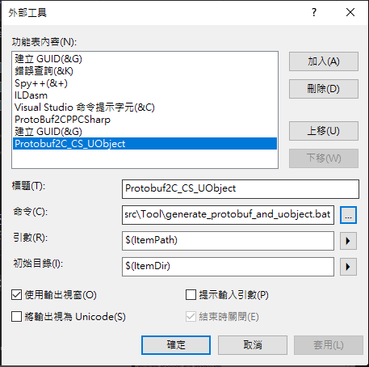
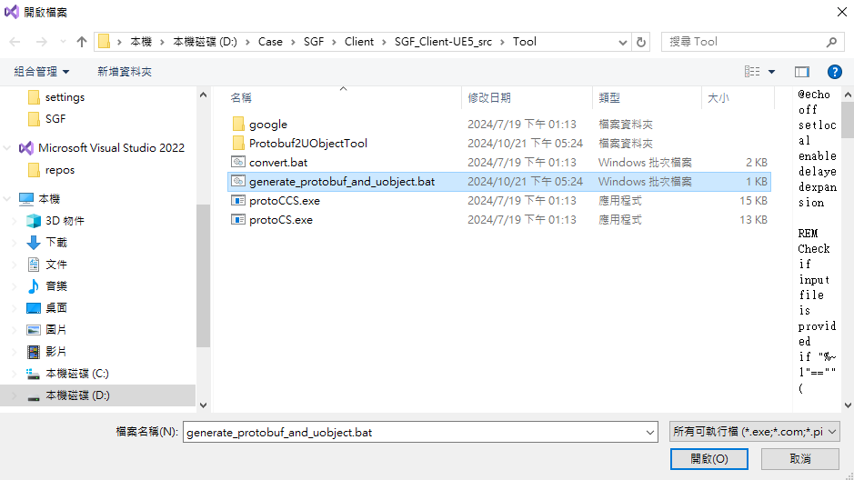

# Protobuf to Unreal C++ 轉換工具

這個工具用於將 Protobuf 定義文件轉換為 Unreal C++ 代碼。

## 使用方法

### 1. 運行可執行文件

使用以下命令運行轉換工具：
```console
protobuf2uobject.exe -i <輸入文件路徑>
```

### 2. 設置輸出目錄

在運行程序之前，請確保已經正確設置了輸出目錄。輸出目錄在 `settings/config.yaml` 文件中指定。

1. 打開 `settings/config.yaml` 文件
2. 找到 `ue_generator_code_output_dir` 選項
3. 設置為您希望輸出生成代碼的目錄路徑

## 配置文件說明

### config.yaml

`settings/config.yaml` 文件用於配置生成器的各種選項。主要設置包括：

- `version`: 配置文件版本
- `ue_generator_code_output_dir`: 生成代碼的輸出目錄
- `ue_project_name`: Unreal Engine 項目名稱
- `parent_class`: 父類配置
  - `name`: 父類名稱
  - `parent_class`: 父類的父類名稱
  - `class_macro`: 類宏
  - `property_macro`: 屬性宏
- `child_class`: 子類配置
  - `class_macro`: 類宏
  - `property_macro`: 屬性宏
- `enum_class`: 枚舉類配置
  - `macro`: 枚舉類宏

可以根據目需求修改這些設置。

### type_matching.yaml

`settings/type_matching.yaml` 文件用於定義 Protobuf 類型到 Unreal C++ 類型的映射關係。

- `protobuf_2_ue`: 定義了 Protobuf 類型到 Unreal C++ 類型的映射
- `function_transfer`: 定義了特定類型在轉換時需要使用的函數

如果您需要支持新的類型或修改現有的類型映射，可以在這個文件中進行調整。

## 注意事項

- 確保 `settings/config.yaml` 和 `settings/type_matching.yaml` 文件存在且格式正確。
- 在修改配置文件時，請遵循 YAML 的語法規則。
- 如果您添加了新的 Protobuf 類型，請確保在 `type_matching.yaml` 中為其添加相應的 Unreal C++ 類型映射。

如果您在使用過程中遇到任何問題，請檢查輸入文件和配置文件是否正確，並確保程序有足夠的權限讀取輸入文件和寫入輸出目錄。

## 使用 generate_protobuf_and_uobject.bat

提供了一個便捷的 .bat 文件，可以一次性運行 ProtoCCS.exe 和 protobuf2uobject.exe：


1. 打開命令提示符。
2. 導航到包含 `generate_protobuf_and_uobject.bat` 的目錄。
3. 運行以下命令：
